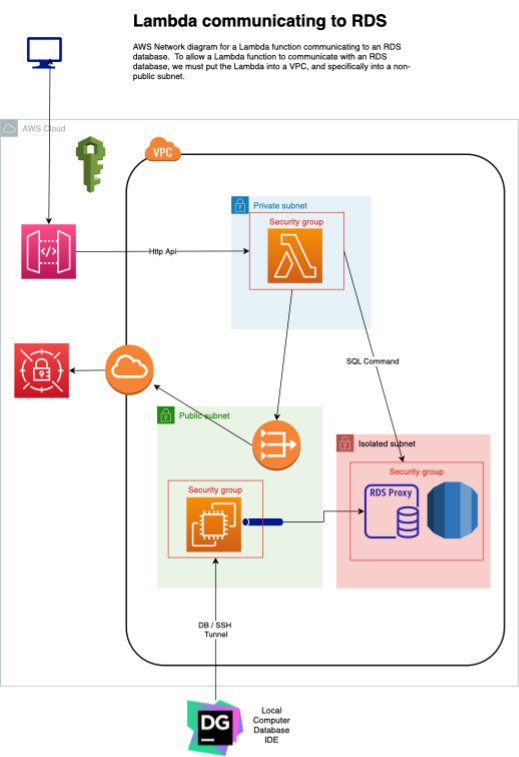

# Lambda / RDS CDK Example

This repo contains a project that outlines the steps to create a network architecture that allows a Lambda to communicate with an RDS MySQL database.

Having a Lambda communicate with an RDS database requires that the Lambda be associated with a VPC.  This single requirement creates a heap of complexity.

It should be noted, if your application can use the RDS DataApi, then you do NOT have to put the Lambda into a VPC.  This is something to seriously consider.  However this project specifically looked at how to setup the network architecture to directly communicate with an RDS database.  It also will setup a Bastion box to tunnel a database connection to the Isolated database.

## Things to keep in mind

* You must put the Lambda in a VPC should you want to direct connect to an RDS database
* You should consider using RDS Proxy to manage the connection pool in front of the RDS database
* The RDS database should go into an Isolated Subnet, which means no traffic and no traffic out unless specifically granted
* The Lambda should go into Private Subnet, with NAT gateway access so it can get to outside services.  Your other option is to create a VPC endpoint to the SecretsManager.
* The EC2 Bastion box should be in the Public Subnet. It will be used to tunnel traffic to the RDS database.
* A number IAM permissions needed to be created
* Your account, or the profile you are running the CDK with, must have the `AWSServiceRoleForRDS` IAM role
* 

### The RDS Proxy Example

This project is based on the [cdk-patterns/serverless/the-rds-proxy](https://github.com/cdk-patterns/serverless/tree/main/the-rds-proxy)

### AWS Blogs

https://aws.amazon.com/blogs/infrastructure-and-automation/use-aws-cdk-to-initialize-amazon-rds-instances/

https://aws.amazon.com/blogs/security/how-to-securely-provide-database-credentials-to-lambda-functions-by-using-aws-secrets-manager/

https://aws.amazon.com/blogs/security/how-to-securely-provide-database-credentials-to-lambda-functions-by-using-aws-secrets-manager/

### Lambda / MySql RDS Example Blog

https://levelup.gitconnected.com/aws-lambda-with-rds-using-pymysql-23ad3cde46c8

### YouTube Videos

[AWS RDS MySQL Database Setup](https://www.youtube.com/watch?v=Ng_zi11N4_c&t=0s)

[How to Query RDS MySQL From AWS Lambda in Python | Step by Step Tutorial](https://www.youtube.com/watch?v=vyLvmPkQZkI)
